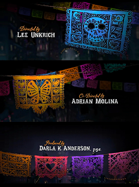
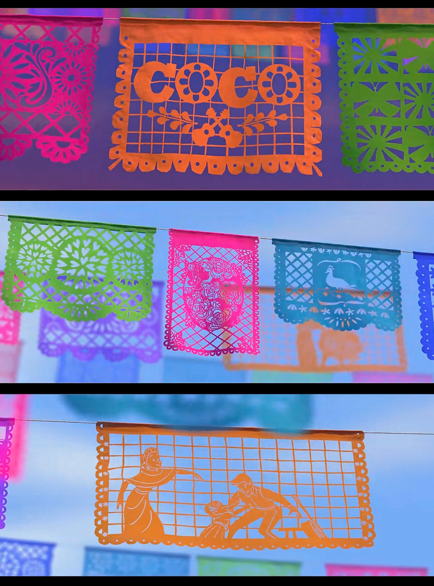

# Imaging Technique Inspiration
I was inspired by the papel picado scenes from the movie Coco. The paper-cut patterns are delicate and symmetrical. They repeat again and again, creating rhythm and depth. These shapes remind me of fractal and recursive visuals. I like how simple forms can become complex when they are repeated and mirrored. These elements can be used as the background part of our final project to enhance the visual richness.



# yuxu0600_9103_tut1

```
function helloWorld() {
console.log("Hello, world!");
}
```